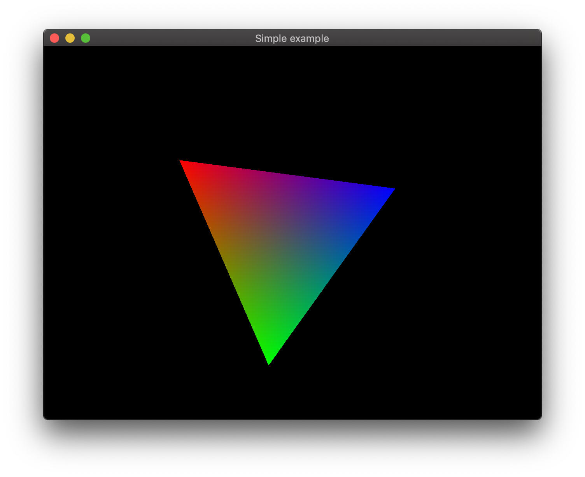

# OpenGL
## Окно

## Треугольник

## Матричные преобразования

## Интерполяция цвета по гряням треугольника

## Цвет на 3д объекте

## Текстурирование

## Загрузка модели из файла

## Нормали

## "Шейдинг"

## Вывод текста

## Прозрачность

## Освещение

## Частицы

## Рендеринг в текстуру

## Билборды

## Сглаживание

## Анимация

